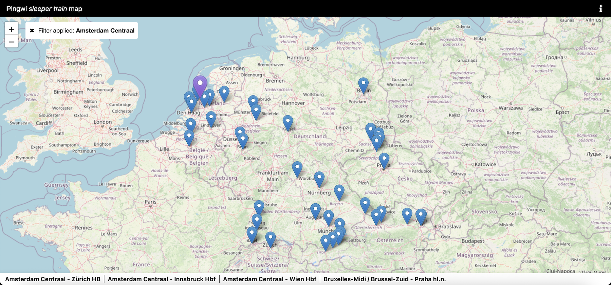

# Sleeper Train Map



## Overview

The **Sleeper Train Map** is a web application that visualizes direct night sleeper train routes across Europe. By selecting a station, users can easily see all reachable destinations via sleeper trains.

## Live Demo

Experience the application live: [https://sleeper-train-map.vercel.app](https://sleeper-train-map.vercel.app)

## Features

- **Interactive Map**: Displays a map with all available sleeper train routes.
- **Station Filtering**: Users can filter routes starting from a specific station to see direct connections.
- **User-Friendly Interface**: Simple and clean design for seamless navigation.

## Technologies Used

- **JavaScript**: Core programming logic.
- **SCSS/CSS**: For styling and visual appeal.
- **OpenStreetMap**: Provides the base map for station visualization.
- **Vercel**: Deploys the live application.

## Getting Started

### Prerequisites

Ensure you have the following installed:

- [Node.js](https://nodejs.org/)
- [npm](https://www.npmjs.com/) or [yarn](https://yarnpkg.com/)

### Installation

1. Clone the repository:
   ```bash
   git clone https://github.com/TheMrBooblik/sleeper-train-map.git
   cd sleeper-train-map
   ```

2. Install dependencies:
   ```bash
   npm install
   # or
   yarn install
   ```

3. Start the development server:
   ```bash
   npm start
   # or
   yarn start
   ```

4. Open your browser and navigate to `http://localhost:3000`.

## Contributing

Contributions are welcome! Please follow these steps:

1. Fork the repository.
2. Create a new feature branch:
   ```bash
   git checkout -b feature-name
   ```
3. Commit your changes:
   ```bash
   git commit -m "Description of changes"
   ```
4. Push to your forked repository:
   ```bash
   git push origin feature-name
   ```
5. Open a pull request.

## License

This project does not currently specify a license. If you are the owner, consider adding a license.

## Acknowledgements

- Special thanks to the [Back-on-Track.eu](https://github.com/Back-on-Track-eu) project for inspiration and resources.
- Thanks to: [OpenStreetMap](https://www.openstreetmap.org/) for the map data.
- Deployment powered by [Vercel](https://vercel.com/).

---
Feel free to explore and enhance the project!
